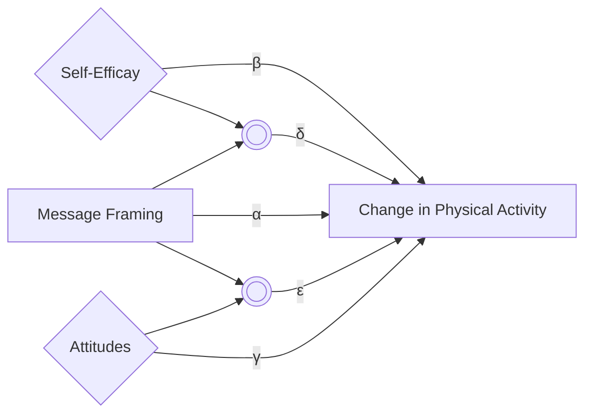

# The Impact of Message Framing in Physical Activity (Bachelor's Thesis)

## Overview
In this project, I aimed to understand the impact of message framing on physical activity levels. To do this, I sent 2 different types of emails: positive, negative, (and also included a control group with no emails), and measured the difference in activity levels over a span of a month. In the end, no significant results were found, although I believe this reflects on the nature of the intervention rather than the overall effectivity of message framing.

## Methods
- Describe the research design (e.g., survey, experiment, field study).
- Tools used (e.g., Python for data analysis, R, Qualtrics for surveys).
- Data collection and sample details (ensuring privacy/anonymization).

## Analysis and Code

In essence the idea behind the model is as follows. We used a moderation model, where the type of message (positive, negative, or control) was the independent variable, self-efficacy and attitudes towards physical activity were moderators, and the difference in physical activity over a period of a month was the dependent variable. In a flow chart, we can visualize this as




Here you can find my complete thesis.
 <iframe src="../../assets/Bachelor_Thesis.pdf" width="90%" height="500px" style="border: none;"></iframe>

The code I used is 
```
import numpy as np
print(Hello world)
```

`def func(hello: int) -> float`


Optionally embed static images of key plots/results below:


## Results
Summarize findings and their implications. Explain how results informed decisions or further research.

## Impact
My results highlight that using emails as an intervention system was not an effective technique. Indeed, the participants which received negative and positive framing exhibited no statistically significant difference in activity levels from the control group. This should be considered in further interventions, and perhaps other methodologies (like mobile applications) should be adopted. In particular, it is a step forward in understanding what type of behavioural interventions should be used to make an impact in the activity levels of students.

## Next Steps & Reflections
What could be improved, follow-up studies, lessons learned.
